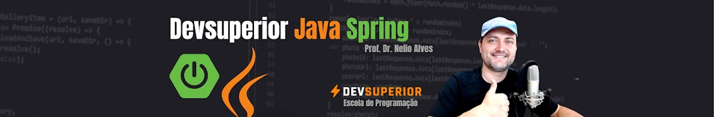
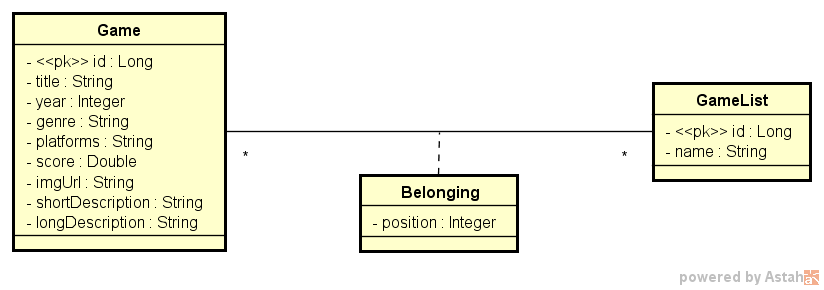
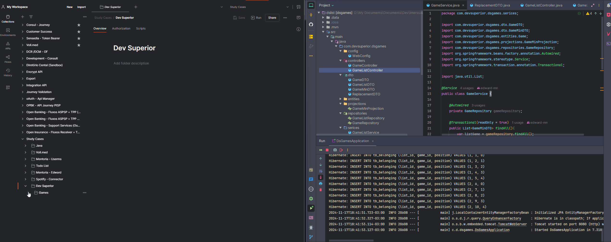

  <h1 align="center"> 🕹️Game List - Dev Superior 🕹️</h1>

  
   
  
  
  
  

<strong>
  

    <a href="#-about">About</a> |
    <a href="#-demo">Demo</a> |
    <a href="#-dependencies">Dependecies</a> |
    <a href="#-functionalities">Functionalities</a> |
    <a href="#-technologies">Technologies</a> |
    <a href="#-how-to-execute-and-download">How to execute</a> |
    <a href="#-author">Author</a> | 
    <a href="#-show-your-support">Suport</a>
  

</strong>

## 🧐 About

This project is a web application for managing game lists, developed in Java with Spring Boot. It allows users to list, search, sort, and manage games through a REST API, supporting different environments:

- **Development**: Uses H2 in-memory database.
- **Homologation**: Uses Docker with PostgreSQL.
- **Production**: Deployed on Railway with PostgreSQL.

<figure style="text-align: center;">
  
  <figcaption>Domain Model</figcaption>
</figure>

## 👀 Demo

> [Postman collection🧑🏽‍🚀](src/main/resources/templates/dsgames_postman_collection.json)

- ### Local

- ### Cloud (Railway)️

> Deploy's endpoint -> https://dsgames-production.up.railway.app (Only backend)

## 🫡 Dependencies
To run this project in your machine, you will need to install some dependencies and made some configurations, therefore use this [documentation](https://efficient-sloth-d85.notion.site/Curso-de-Java-2408d11bfc3447e980fe9460b6293976):
- [Java & Kit](https://www.oracle.com/java/technologies/javase/jdk17-archive-downloads.html)
- [Maven](https://maven.apache.org/)
- [IntelliJ IDEA](https://www.jetbrains.com/idea/)
- [Postman](https://www.postman.com/)

## 🖥 Functionalities

:new: List you games:
- Resource capable of to list your games.
  
:new: Get a specific game:
- Resource capable of to list a specific game.
  
:new: List kind of games:
- Resource capable of to list game's kind.

:new: Get a specific game by list:
- Resource capable of to list a specific game in a specific list.

:new: Reorder game list:
- Resource capable of to re-ordinate a game into a list.

## 👷 How to <b>Execute<b> and [Download](https://github.com/edward-mn/dsgames/archive/refs/heads/main.zip)

### Local 🏡

#### Downloading & Execute the project ⏬
1. Download the project on your machine.
2. Extract the downloaded zip.
3. Create a new project from an existing project (**Import project**).
4. After the project loaded in your IDE click with the right button on the project name -> Maven -> Reimport to confirm the necessary imports.
5. Click on the top right of your ide (ADD CONFIGURATIONS) -> (+) -> Maven.
6. In the "Command Line" field add (spring-boot:run) -> Apply -> OK.
7. Ready now, just run the program and the server is running on port 8080.
8. Ready to access!
9. Open your browser into port 8080 (<i> http://localhost:8080/ </i>)

### Everywhere 🗺

### Using Postman 👨‍🚀
1. Open the postman
2. Import the collection
    1. In the upper left corner click (Import) -> Choose Files -> Go to where you extracted the project and the select the [Postman collection🧑🏽‍🚀](src/main/resources/templates/dsgames_postman_collection.json) file
    2. Now, select the endpoint that you want within the imported collection and click in send.
    3. Use as you want and wish!

## 🛠 Technologies
- [IntelliJ IDEA](https://www.jetbrains.com/idea/)
- [Java 17 & Kit](https://www.oracle.com/java/technologies/javase/jdk17-archive-downloads.html)
- [Spring boot](https://spring.io/projects/spring-boot)
- [Postman](https://www.postman.com/)
- [Docker](https://www.docker.com/)
- [ORM](https://docs.spring.io/spring-framework/reference/data-access/orm.html)
- [PostgresSQL](https://www.postgresql.org/)
- [H2](https://www.baeldung.com/spring-boot-h2-database)
- [CI / CD](https://unity.com/pt/topics/what-is-ci-cd)
- [Dependencies - Maven](https://mvnrepository.com/artifact/org.springframework.boot/spring-boot-starter)
    - [Loombok](https://projectlombok.org/)
    - [DevTools](https://www.baeldung.com/spring-boot-devtools)
    - [Data JPA](https://spring.io/projects/spring-data-jpa)
    - [Spring Web](https://docs.spring.io/spring-boot/docs/current/reference/htmlsingle/)

## 🦹‍ Author

* [**Edward Moreira**](https://aboute-me.netlify.app/)
* [@edward-mn](https://github.com/edward-mn) :octocat:
* 

## 🤝 Show your support

Give a ⭐️ if liked or helped you!

***

<strong>
  
 This README was created with ❤️ by me 

</strong>